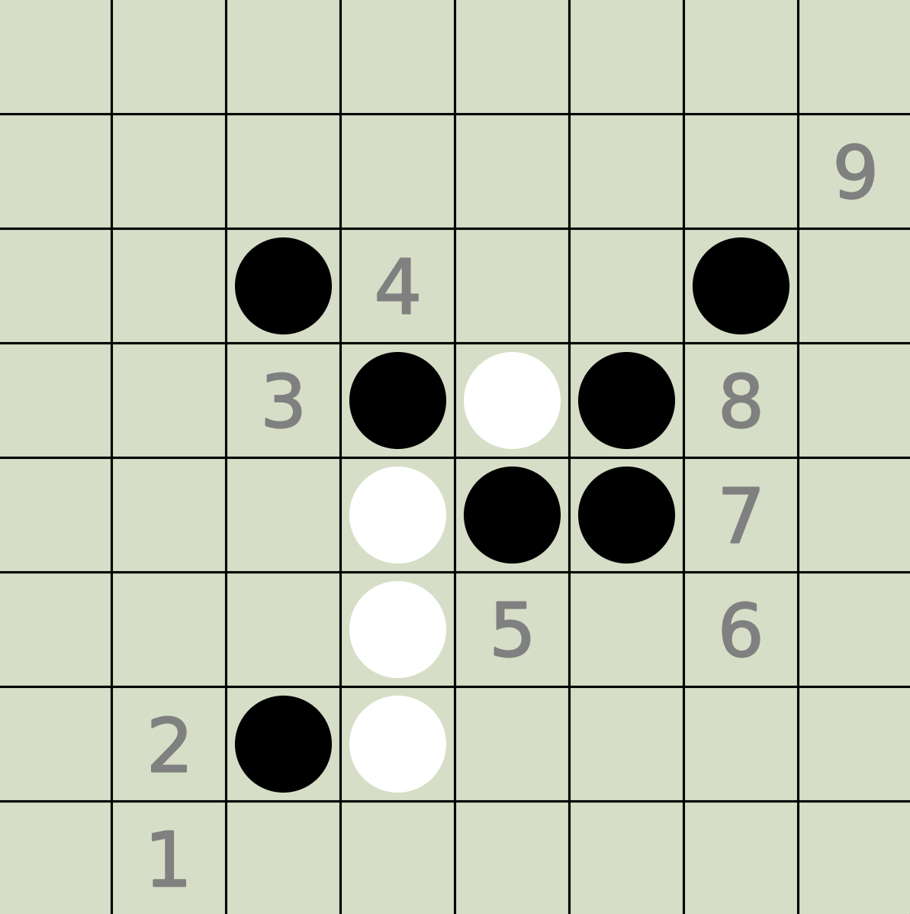

# Reinforcement Learning for Othello

An Othello Environment for Reinforcement Learning Learning and Testing. Run Play.py to start the game.

## Requirements: 

1. numpy 
2. matplotlib 
3. torch 
4. einops 
5. tqdm 
6. gymnasium

## Features: 

1. Othello Environments: 
   1. Parallelisable: Batch running, full use of GPU. It may not perform as well at smaller batch sizes, but it still can save the cost of transferring data between the CPU and GPU. 
   2. Support the standard interface of Gymnasium. 
2. Policy Gradient: 
   1. Only Actor.
   2. Online Learning. 
   3. Use Mask to eliminate moves on invalid positions, and modify the default probability distribution used in calculating KL dispersion accordingly. 
   4. Versus random win rate: 99%.
3. PPO: 
   1. Only Actor.
   2. Online Learning. 
   3. Versus random win rate: 99.8%.

4. PPO:
   1. Actor + Critic.
   2. GAE: reducing the variance.
   3. Versus random win rate: 99.8%.

## TODO：

1. PPO ✅
2. GAE + Critic ✅
3. Monte-Carlo Search ⌛
4. SAC ⌛
5. DQN ⌛
6. DDQN ⌛
7. TD3 ⌛

